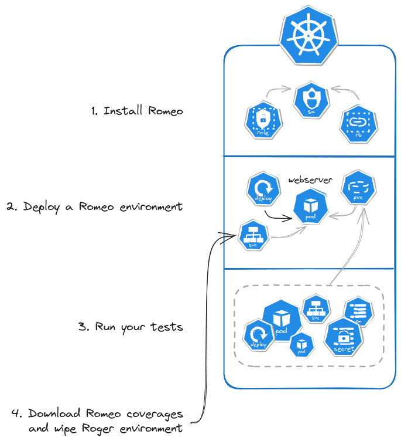

<div align="center">
    <h1>Romeo</h1>
    <p>O Romeo, Romeo, whatfore art coverages Romeo?</p>
    <a href="https://pkg.go.dev/github.com/ctfer-io/romeo"></a>
    <a href=""></a>
    <a href="https://coveralls.io/github/ctfer-io/romeo?branch=main"></a>
	<br>
	<a href="https://github.com/ctfer-io/romeo/actions/workflows/codeql-analysis.yaml"></a>
    <a href="https://securityscorecards.dev/viewer/?uri=github.com/ctfer-io/romeo"></a>
    
</div>

## How it works

Romeo creates ephemeral environments on a Kubernetes cluster to measure Go binaries coverage.
This work based on [this blog post](https://go.dev/blog/integration-test-coverage), so require **Go >= 1.20**.

<div align="center">
    
</div>

The repository is structured as follows:
1. [Webserver](webserver) is a Go server exposing an API that remotly executes the Go coverage merge.
2. The resulting coverage data are later fetched by the [download Action](download).
3. To deploy this you firstly instanciate a [deployment](deployment).
4. To avoid passing a privileged account you can restrein the RBAC accesses with a pre-deployment [install](install).

## Usage

The recommended process is to run both [install](install) and [deployment](deployment) in a workflow.
This provides good isolation thus ensure actual Go coverages.

It is acceptable, mostly for performance reasons, to pre-[install](install) Romeo RBAC resources thus only running a [deployment] per workflow.
Refer to their own documentation to implement this in your process.

Configure secrets and inputs accordingly to each action/step documentation.

```yaml
name: Run Go tests

on: [push]

jobs:
  test:
    runs-on: ubuntu-latest
    steps:
      - uses: actions/checkout@v4

      - name: Setup Go
        uses: actions/setup-go@v5
        with:
          go-version-file: 'go.mod'

      - uses: pulumi/actions@v6

      - name: Cache Go modules
        uses: actions/cache@v4
        with:
          path: |
            ~/.cache/go-build
            ~/go/pkg/mod
          key: ${{ runner.os }}-go-${{ hashFiles('**/go.sum') }}
          restore-keys: |
            ${{ runner.os }}-go-

      # ... Run your Go unit tests ...

      # Login local by default, you can login somewhere else. Adapt to your needs.
      - name: Pulumi login
        run: |
          pulumi login --local

      - name: Romeo install
        id: install
        uses: ctfer-io/romeo/install@v1
        with:
          kubeconfig: ${{ secrets.KUBECONFIG }}
          api-server: ${{ secrets.API_SERVER }}

      - name: Romeo environment
        id: env
        uses: ctfer-io/romeo/environment@v1
        with:
          kubeconfig: ${{ steps.install.outputs.kubeconfig }}
          namespace: ${{ steps.install.outputs.namespace }}

      - name: Run functional tests
        run: |
          go test ./... -run=^Test_F_ -json | tee -a gotest.json
        env:
          # Use a ServiceAccount with enough privileges to deploy the resources you require.
          # If not possible, you can use an administration account.
          KUBECONFIG: ${{ secrets.KUBECONFIG }}
          CLAIM_NAME: ${{ steps.env.outputs.claim-name }}
          NAMESPACE: ${{ steps.env.outputs.namespace }}
          # Put additional configuration if necessary...

      - name: Download coverages
        id: download
        uses: ctfer-io/romeo/download@v1
        with:
          server: ${{ secrets.SERVER_BASE }}:${{ steps.env.outputs.port }}

      - name: Merge coverages
        run: |
          go tool covdata textfmt -i="${{ steps.download.outputs.directory }}" -o cov.out

      - name: Upload coverage to Coveralls
        uses: shogo82148/actions-goveralls@v1
        with:
          path-to-profile: cov.out
```

## Security

### Signature and Attestations

For deployment purposes (and especially in the deployment case of Kubernetes), you may want to ensure the integrity of what you run.

The release assets are SLSA 3 and can be verified using [slsa-verifier](https://github.com/slsa-framework/slsa-verifier) using the following.

```bash
slsa-verifier verify-artifact "<path/to/release_artifact>"  \
  --provenance-path "<path/to/release_intoto_attestation>"  \
  --source-uri "github.com/ctfer-io/romeo" \
  --source-tag "<tag>"
```

The Docker image is SLSA 3 and can be verified using [slsa-verifier](https://github.com/slsa-framework/slsa-verifier) using the following.

```bash
slsa-verifier slsa-verifier verify-image "ctferio/romeo:<tag>@sha256:<digest>" \
    --source-uri "github.com/ctfer-io/romeo" \
    --source-tag "<tag>"
```

Alternatives exist, like [Kyverno](https://kyverno.io/) for a Kubernetes-based deployment.

### SBOMs

A SBOM for the whole repository is generated on each release and can be found in the assets of it.
They are signed as SLSA 3 assets. Refer to [Signature and Attestations](#signature-and-attestations) to verify their integrity.

A SBOM is generated for the Docker image in its manifest, and can be inspected using the following.

```bash
docker buildx imagetools inspect "ctferio/romeo:<tag>" \
    --format "{{ json .SBOM.SPDX }}"
