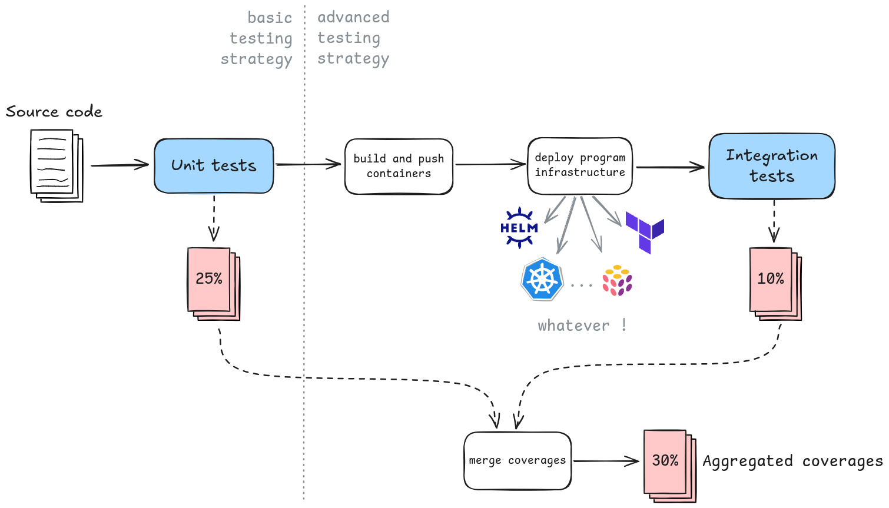
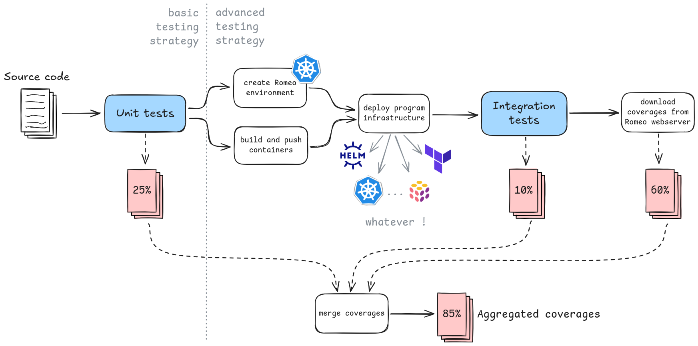

<div align="center">
    <h1>Romeo</h1>
    <p>O Romeo, Romeo, whatfore art coverages Romeo?</p>
    <a href="https://pkg.go.dev/github.com/ctfer-io/romeo"></a>
    <a href=""></a>
    <a href="https://coveralls.io/github/ctfer-io/romeo?branch=main"></a>
	<br>
	<a href="https://github.com/ctfer-io/romeo/actions/workflows/codeql-analysis.yaml"></a>
    <a href="https://securityscorecards.dev/viewer/?uri=github.com/ctfer-io/romeo"></a>
    
</div>

Romeo gives the capability to **reach high code coverage** of Go ≥1.20 apps.
It helps measuring code coverage for **functional and integration tests** within GitHub Actions.

Nevertheless, it is not limited to these use cases.
For instance it can be used for **in-production code coverage** measurement, which could serve for process mining, code debloating, and so on.

The design is generic so **whatever your software testing technology stack is**, it might fit your needs: Helm, Terraform, Pulumi, RobotFramework, in-house solutions, ... Making adoption of Romeo **low cost**.

This work is based upon [Than McIntosh blog post "Code coverage for Go integration tests"](https://go.dev/blog/integration-test-coverage) and [doc page](https://go.dev/doc/build-cover).

- [How it works](#how-it-works)
  - [Context](#context)
  - [What Romeo does](#what-romeo-does)
  - [Integration](#integration)
- [Usage](#usage)
- [Security](#security)

## How it works

### Context

Beyond testing for Quality Assurance, we also want to monitor what portion of the code is actually tested. This helps Software Development and Quality Assurance engineers to pilot where to focus the efforts. For instance, it can help detect what conditions where not covered at all during the whole process (e.g. an API method of a Service, or a common error).

It is especially true in the context of Micro Services Architectures, which is CTFer.io's reason for creating Romeo.

In Go, measuring code coverage can be performed during tests with the `-coverprofile` flag. It is often used for unit tests, and sometimes for functional and integrations tests. The common approaches can be summed up in the following workflow (values are fictive).

<div align="center">
  
</div>

### What Romeo does

The common approaches presented above throws away a lot of data: what lines were executed during my program lifecycle ?

To avoid loosing that much value, Romeo watches over the Go binary coverages. It is simply integrated within your existing worklow.
The modified version of the previous worklow follows (values are fictive).

<div align="center">
  
</div>

### Integration

Romeo creates an **ephemeral environment** on a Kubernetes cluster and provides a `PersistentVolumeClaim` for Go binaries to write coverages into, automatically once compiled with the `-cover` flag and run with the `GOCOVERDIR` environment variable.
Then the program is tested (functional, integration, smoke, e2e, load/stress, ...), and results are exported as always.
The coverages are downloaded and written on filesystem, and can then be exported to the provider of your choice: Coveralls.io, SonarQube, ...

The integration is typically based on 5 steps:
1. [Install Romeo](./install/) (not required yet recommended)
2. [Deploy a Romeo environment](./environment/)
3. Deploy your app and run your tests
4. [Download the coverages](./download/)
5. Manipulate them, merge with others, export wherever

> [!TIP]
> [Romeo uses itself to measure its code coverage](.github/workflows/e2e.yaml) through unit and integration tests.
> If you have trouble understanding how it could integrate within your workflow, it might be a good start !

## Usage

The recommended process is to run both [install](./install) and [environment](./environment) in a workflow.
This provides good isolation with adjacent systems, and ensure actual coverages (no parallel runs pollutes data).

It is acceptable, mostly for performance reasons, to pre-[install](install) Romeo thus only running an [environment](environment) per workflow.
Refer to their own documentation to implement this in your process.

Please configure secrets and inputs accordingly to each step documentation.

An example workflow follows.

```yaml
name: Run Go tests

on: [push]

jobs:
  test:
    runs-on: ubuntu-latest
    steps:
      - uses: actions/checkout@v4

      - name: Setup Go
        uses: actions/setup-go@v5
        with:
          go-version-file: 'go.mod'

      - uses: pulumi/actions@v6

      - name: Cache Go modules
        uses: actions/cache@v4
        with:
          path: |
            ~/.cache/go-build
            ~/go/pkg/mod
          key: ${{ runner.os }}-go-${{ hashFiles('**/go.sum') }}
          restore-keys: |
            ${{ runner.os }}-go-

      # ... Run your Go unit tests ...

      # Install Pulumi and login locally (adapt if needed).
      # Required steps for Romeo to work.
      - name: Install Pulumi
        uses: pulumi/actions@v6
      - name: Prepare environment
        run: |
          pulumi login --local

      - name: Romeo install
        id: install
        uses: ctfer-io/romeo/install@v1
        with:
          kubeconfig: ${{ secrets.KUBECONFIG }}
          api-server: ${{ secrets.API_SERVER }}

      - name: Romeo environment
        id: env
        uses: ctfer-io/romeo/environment@v1
        with:
          kubeconfig: ${{ steps.install.outputs.kubeconfig }}
          namespace: ${{ steps.install.outputs.namespace }}

      - name: Run integration tests
        run: |
          go test ./... -run=^Test_I_ -coverprofile=functional.cov
        env:
          # Use a ServiceAccount with enough privileges to deploy the resources you require.
          # If not possible, you can use an administration account.
          KUBECONFIG: ${{ secrets.KUBECONFIG }}
          CLAIM_NAME: ${{ steps.env.outputs.claim-name }}
          NAMESPACE: ${{ steps.env.outputs.namespace }}
          # Put additional configuration if necessary...

      - name: Download coverages
        id: download
        uses: ctfer-io/romeo/download@v1
        with:
          server: ${{ secrets.SERVER_BASE }}:${{ steps.env.outputs.port }}

      # If you have multiple coverage files, please merge.

      - name: Upload coverage to Coveralls
        uses: shogo82148/actions-goveralls@v1
        with:
          path-to-profile: cov.out
```

## Security

The security of the [webserver](./webserver/) is detailed [here](./webserver/README.md#security) (signatures, attestations, and SBOMs).

The Romeo architecture is hardened by design to require only the minimal permissions, within an isolated namespace.
We accept contributions and issues toward improving this security posture and documentation.
