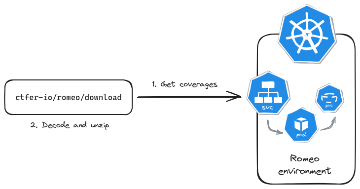

# Romeo download

Download a [Romeo environment](../environment)'s coverages from an Action.

It reaches the [Romeo webserver](../webserver) to archive and ship the coverages it reads from the shared volume of the Romeo environment, given the following architecture.

<div align="center">
    
</div>

## Usage

### GitHub Actions

To download coverages from a Romeo environment, use `ctfer-io/romeo/download`.

```yaml
      - name: Download coverages
        id: download
        uses: ctfer-io/romeo/download@v1
        with:
          server: ${{ secrets.SERVER_BASE }}:${{ steps.env.outputs.port }}
```

#### Inputs

| Name | Type | Default | Description |
|---|---|---|---|
| `server` | String |  | Server URL to reach out the Romeo environment. |
| `directory` | String | `coverout` | Directory to export the coverages data. |

#### Outputs

| Name | Type  | Description |
|---|---|---|
| `directory` | String | Directory the coverages data were exported to. |

### Manually

The download action is a thin helper around the [Romeo webserver](../webserver) API: you can totally do it by hand.
You need to reach the API at `/coverout` (`GET` method), then decode base 64 and unzip the result to the filesystem.

```bash
# From the Romeo environment directory
curl "$SERVER_BASE:$(pulumi stack output -j | jq -r '.port')/coverout" | jq -r '.merged' | base64 -d > cov.zip
unzip cov.zip && rm cov.zip
```
