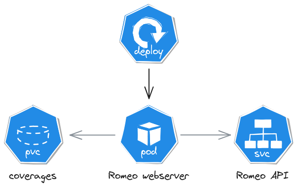

# Romeo environment

Deploy a Romeo environment from an Action, or manually.

A Romeo environment provides the capability to measure binaries coverages. It finds most value through tests/IVV, especially for code coverage through functional and integration tests.

The Kubernetes ephemeral infrastructure particularly results in a PersistentVolumeClaim (PVC). It must be mounted within the Pod that contains the measured container. It also exposes a [Romeo webserver](../webserver/) such that its API is reachable by the CI (to extract coverage data).

<div align="center">
    
</div>

We recommend **one Romeo environment per container** you are measuring coverages.

To build Romeo-compatible binaries, you must ensure the following:
1. Go ≥1.20
1. build the binary with the `-cover` flag
1. the PVC is mounted within the container
1. `GOCOVERDIR` is set to the PVC mounting point

## Usage

### GitHub Actions

To deploy a Romeo environment from an Action, we recommend you deploy a [Romeo install](../install) yet it is not required.
In the following steps examples, we consider a Romeo install.

```yaml
      - name: Romeo environment
        id: env
        uses: ctfer-io/romeo/environment@v1
        with:
          kubeconfig: ${{ steps.install.outputs.kubeconfig }}
          namespace: ${{ steps.install.outputs.namespace }}
```

You can then mount the PVC claim name (see [outputs](#outputs)) with the technology of your choice: Helm, Terraform, 

> [!IMPORTANT]
> Your program **must** mount the PVC, but also **run and stop**.
>
> If your program is improperly stopped, or not stopped at all, the coverages are not completly written on disk leading to **incomplete coverages**.

Once your tests ran, you can [download the coverages](../download).

#### Inputs

| Name | Type | Default | Description |
|---|---|---|---|
| `stack-name`| String | `env` | The Pulumi stack name. Usefull when deploying multiple Romeo environments within the same context. |
| `kubeconfig` | String |  | **Required.** The kubeconfig to use for deploying a Romeo environment. |
| `namespace` | String |  | The namespace in which to deploy, in case the kubeconfig has access to many. |
| `harden` | Bool | false | Whether to harden the namespace or not. Deny all traffic, deny inter-namespace communications, then grant DNS resolution, grant internet communications, and grant access to Romeo webserver. If a namespace is defined, only grant access to Romeo webserver. |
| `tag` | String | `latest` | The [Romeo webserver docker tag](https://hub.docker.com/r/ctferio/romeo/tags) to use. |
| `storage-class-name` | String | `standard` | **Required.** The StorageClass name for the PersistenVolumeClaim. |
| `storage-size` | String | `50M` | **Required.** The storage size. |
| `claim-name` | String |  | If specified, turns on Romeo's coverage export in the given PersistenVolumeClaim name. This should only be used by CTFer.io to test Romeo itself. |
| `registry` | String |  | An optional OCI registry to download romeo images from. |
| `pvc-access-mode` | String |  | The PVC access mode to use. |

#### Outputs

| Name | Type | Description |
|---|---|---|
| `port` | String | The port to reach out the Romeo webserver API, as exposed by the Kubernetes cluster. |
| `claim-name` | String | The PersistentVolumeClaim name for binaries to mount in order to write coverage data. |
| `namespace` | String | The namespace in which Romeo has been deployed. Reuse it to target the PersistentVolumeClaim corresponding to the claim-name. |

### Manually

You may want to deploy the "Romeo environment" to test things manually, or from a non-supported CI system (e.g. GitLab, Drone, Travis).

It has the advantage of not requiring an extensive install of Romeo. We still recommend you **run one Romeo environment per workflow run** to ensure proper isolation between multiple runs thus avoid falsing your coverage measurements.

```bash
# Get in deploy directory
cd deploy

# Create stack and configure
export PULUMI_CONFIG_PASSPHRASE="some-secret"
pulumi stack init --stack dev
pulumi config set --secret kubeconfig "$(cat ~/.kube/config)"
pulumi config set namespace ""

# Deploy
pulumi up -y
```
