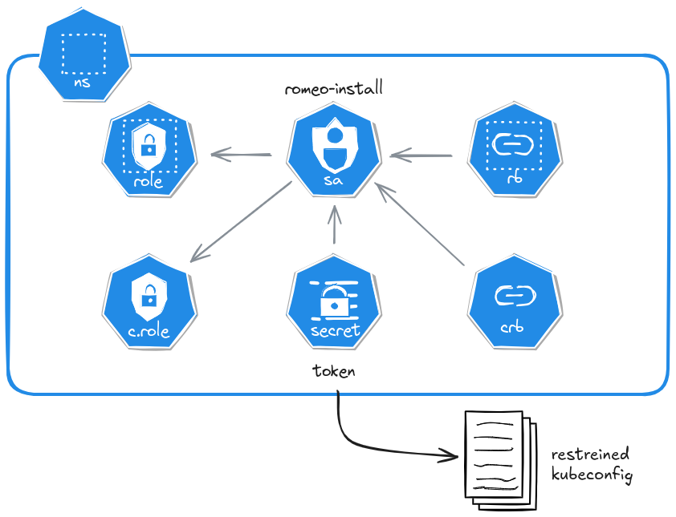

# Romeo Install

Install Romeo from an Action, or manually.

It deploys RBAC resources given the following architecture, according to the needs of a [Romeo environment](../environment).

<div align="center">
    
</div>

## Usage

### GitHub Actions

To deploy a Romeo install from an Action, use `ctfer-io/romeo/install`.
It will create the RBAC resources required by [Romeo environment](../environment) to deploy.

```yaml
      - name: Romeo install
        id: install
        uses: ctfer-io/romeo/install@v1
        with:
          kubeconfig: ${{ secrets.KUBECONFIG }}
          api-server: ${{ secrets.API_SERVER }}
```

At the end of the Action, it will delete the deployed resources.

#### Inputs

| Name | Type | Default | Description |
|---|---|---|---|
| `kubeconfig` | String |  | **Required.** The kubeconfig to use for installing Romeo and generating its own kubeconfig (with restreined privileges). |
| `namespace` | String |  | The namespace to install Romeo into. May be randomly generated, as long as it fits Kubernetes naming specification. If not specified, will be randomly generated. |
| `api-server` | String |  | **Required.** The Kubernetes api-server URL to pipe into the generated kubeconfig. Example: `https://cp.my-k8s.lan:6443`. |

#### Outputs

| Name | Type | Description |
|---|---|---|
| `kubeconfig` | String | The kubeconfig to use for deploying a Romeo environment. |
| `namespace` | String | The namespace in which the install has took place. Pass it to Romeo's environment step and tests/IVV ones to know where to deploy too. |

---

### Manually

You may want to deploy the "Romeo install" once for your whole cluster, so _manually_.

It has the advantage of making it only once, then share its instance between all repositories/CI under tests/IVV.
Nevertheless, sharing is not always caring: collisions can happen, and we encourage you to deploy it once per CI run, or once at least once per repository. This enables you to update seemlessly between repositories rather than having to sync multiple people.

```bash
# Get in deploy directory
cd deploy

# Create stack and configure
export PULUMI_CONFIG_PASSPHRASE="some-secret"
pulumi stack init --secrets-provider passphrase --stack dev
pulumi config set --secret kubeconfig "$(cat ~/.kube/config)"
pulumi config set namespace ""
pulumi config set api-server "https://cp.my-k8s.lan:6443"

# Deploy
pulumi up -y

# Fetch ServiceAccount kubeconfig from outputs
pulumi stack output --show-secrets -j | jq -r '.kubeconfig' > kubeconfig
```
